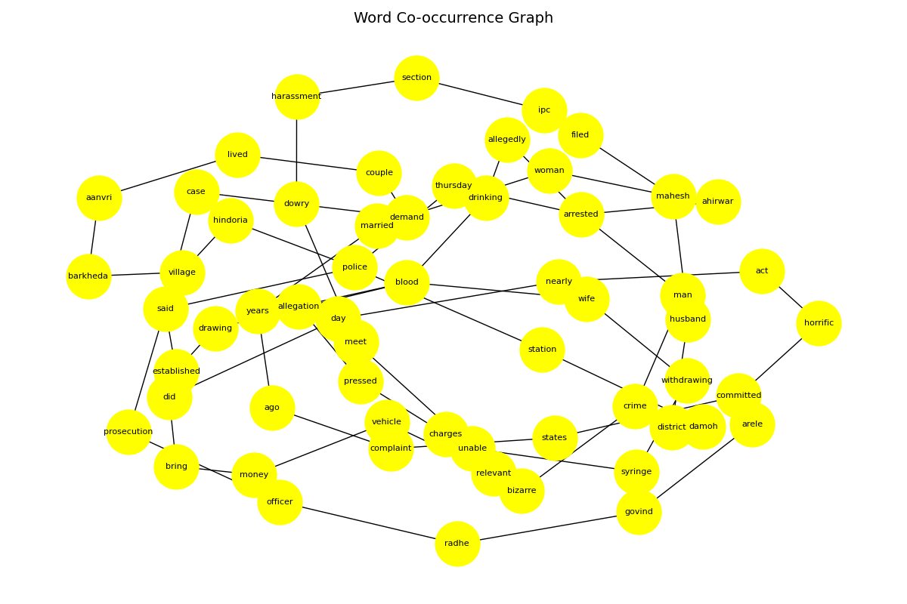

# 📊 Word Co-occurrence Graph & Keyword Extraction

This project extracts **keywords** from text using a **word co-occurrence graph** and the **PageRank algorithm**.  
It builds a graph where nodes are words and edges represent co-occurrence within a sliding window.  
Then, PageRank is applied to rank words by importance, similar to how Google ranks web pages.  

The script also visualizes the co-occurrence graph with `networkx` and `matplotlib`.

---

## 📊 Example Output

```
Top Keywords: 
girls: 0.0436 
marriages: 0.0430 
marriage: 0.0280 
rescued: 0.0270 
welfare: 0.0222 
child: 0.0217 
officials: 0.0211 
stopped: 0.0206 
said: 0.0172 
district: 0.0167 
```

## Graph Visualization:

The script generates a co-occurrence network plot like this:



---

## 📦 Requirements
Install dependencies before running:

```bash
pip install networkx matplotlib scikit-learn
```

## 📝 Usage

- Clone this repository.
- Add your text inside the text variable in word_graph.py.
- Run the script:
```
python word_graph.py
```
- The output will include:
- Top 10 keywords printed with PageRank scores.
```
A graph visualization saved as word_graph_<datasetname>.png.
```
## File Structure

```
.
├── Data # data sets and output
├── Research.py # main script
└── README.md
```

